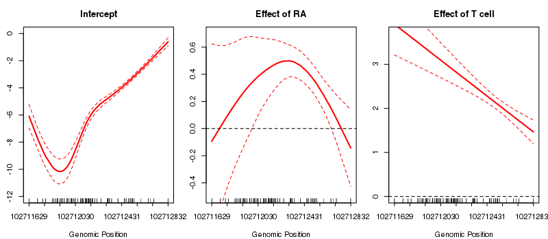

# SOMNiBUS: SmOoth ModeliNg of BisUlfite Sequencing

Identifying disease-associated changes in DNA methylation can help us gain a better understanding of disease etiology. **SOMNiBUS** aims to analyze count-based DNA methylation (measured via bisulfite sequencing) on predefined genomic regions, such as those obtained by targeted sequencing, and thus to identify differentially methylated regions (DMRs) that are associated with phenotypes or traits. Specifically, we built a rich flexible model that allows for the effects, on the methylation levels, of multiple covariates to vary smoothly along genomic regions. At the same time, this method also allows for sequencing errors and can adjust for variability in cell type mixture. Here, penalization introduces smoothness for each covariate effect. 

The package **SOMNiBUS** enable users to estimate smooth covariate effects and to assess statistical significance of methylation regions.


### Installing

You can install the development version of `SOMNiBUS` from GitHub with

```r
if(!require("pacman")) install.packages("pacman")
pacman::p_load_gh("kaiqiong/SOMNiBUS")
```

## An example for getting started

An example of how to use the fun

```r
RAdat.f = na.omit(RAdat[RAdat$Total_Counts != 0,]) # filter the individual CpG sites with zero read-depth
out = BSMethEM(data=RAdat.f, n.k = rep(5,3), p0 = 0.003, p1 = 0.9) # run the analysis
plot_BSMethEM(out) # plot the smooth covariate effect
```



See the vignette for detailed information on how to use the package.


## Learn more

More details of the **SOMNiBUS** method can be found in the manuscript

> Zhao, K., Oualkacha, K., Lakhal-Chaieb, L., Klein, K., Hudson, M., and Greenwood, C.M.T. 
> A novel statistical method for modeling covariate effects in bisulfite sequencing derived measures of DNA methylation 
> *a journal*, 2019.


